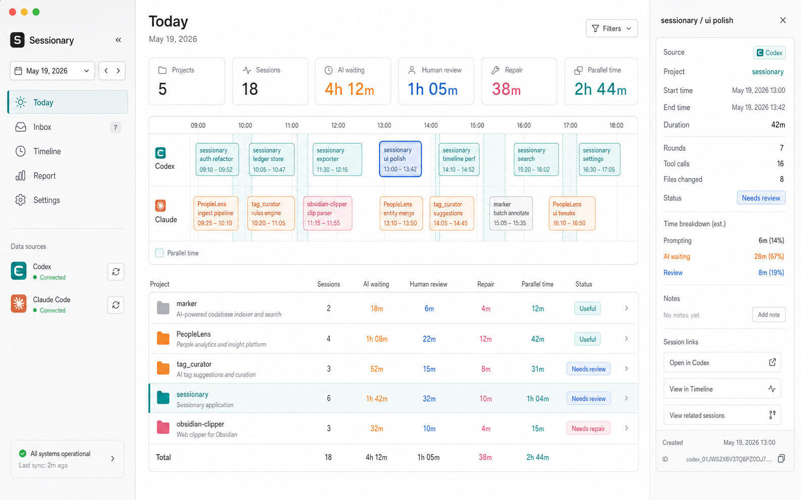
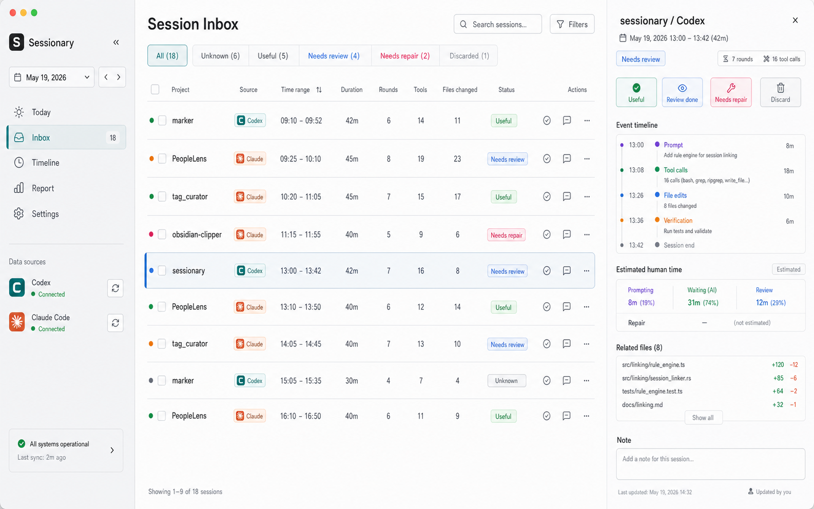
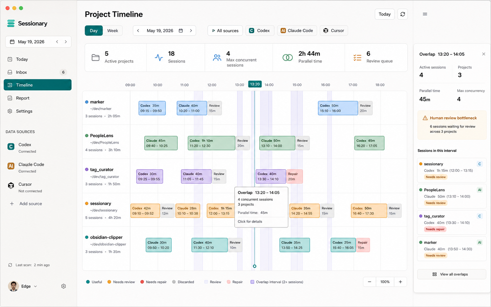
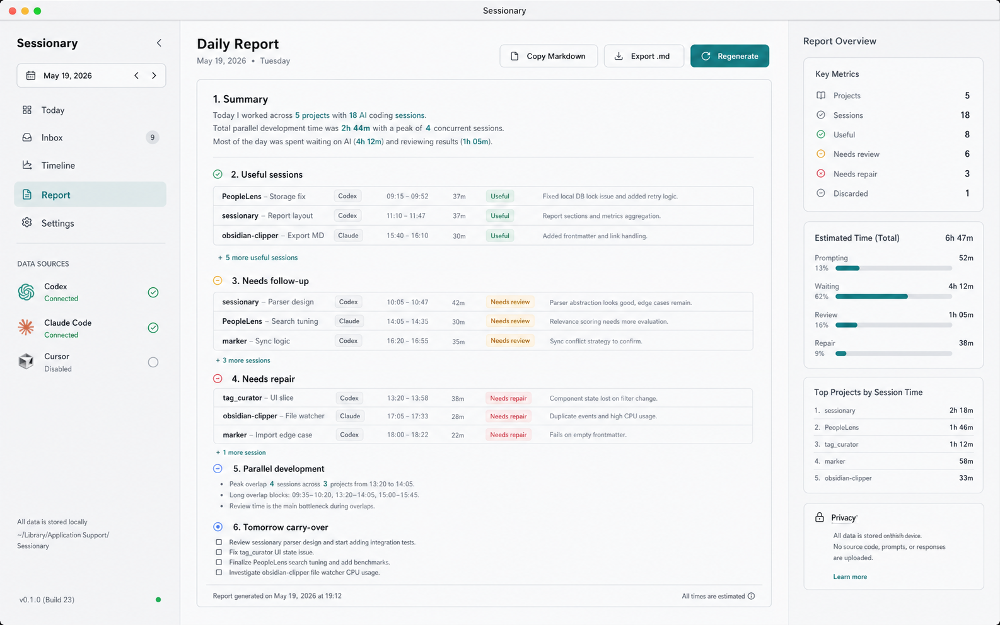

# Sessionary

[](https://github.com/qmkCamel/sessionary/actions/workflows/ci.yml)

Local-first AI coding session ledger for Codex and Claude Code sessions.

Sessionary turns scattered local AI coding logs into a daily ledger: what you
worked on, which sessions ran, where work overlapped, and which sessions still
need review, repair, or follow-up.

> Status: early MVP. The app is useful for local review workflows, but packaged
> releases, signing, auto-update, and team features are not ready yet.

## Screenshots









## What It Does

- Scans local Codex and Claude Code session metadata.
- Builds a daily session inbox for review and cleanup.
- Shows project timelines, session overlap, and parallel work.
- Lets you annotate session status, notes, review time, and repair time.
- Generates an editable daily report that can be copied or exported locally.
- Stores all app data in local SQLite.

## Privacy Model

Sessionary is local-first. It does not include accounts, cloud sync, team
analytics, or telemetry.

The app scans local metadata from:

- `~/.codex/sessions`
- `~/.codex/archived_sessions`
- `~/.claude/projects`
- `~/.claude`

SQLite data is stored in the OS application data directory under
`Sessionary/sessionary.sqlite`.

Read [PRIVACY.md](PRIVACY.md) before running Sessionary on sensitive session
logs.

## Requirements

- Node.js 20.19 or newer
- npm 10 or newer
- Rust 1.95.0
- Tauri 2 system dependencies for your OS

Optional:

- `mise`, if you want to use [mise.toml](mise.toml) to install the pinned Rust
  toolchain
- `rustup`, if you want Cargo to install the pinned toolchain from
  [rust-toolchain.toml](rust-toolchain.toml)

## Run The Desktop App

```bash
npm ci
npm run tauri:dev
```

If you use `mise`, install the pinned toolchain first:

```bash
mise install
npm run tauri:dev
```

## Browser Preview

For frontend-only development:

```bash
npm run dev:web
```

Native Tauri commands are not available in the browser preview, so parts of the
app use fallback data.

## Verify

```bash
npm run openspec:validate
npm run typecheck
npm run build
npm test
```

## MVP Capabilities

- Today dashboard with session, project, estimated time, and parallel metrics.
- First-run onboarding plus Settings / Data Sources with editable Codex and Claude paths.
- Session Inbox with filters, keyboard cleanup, status annotation, brief auto-advance, notes, and manual time correction.
- Project Timeline with project tracks, session blocks, overlap bands, 15m / 30m / 60m zoom, drag selection, and overlap summaries.
- Daily Report generation, editing, clipboard copy, and local Markdown export.
- Rust parsers for Codex JSONL and Claude Code JSONL.
- Claude Code parser fixture coverage for local project JSONL and OpenTelemetry-style JSONL.
- Local SQLite persistence and annotation preservation across rescans.
- Overlap calculation for sessions and cross-project parallel work.

## Project Docs

- [Product positioning](docs/product-positioning.md)
- [MVP capabilities](docs/mvp-capabilities.md)
- [Codebase guide](docs/codebase-guide.md)
- [Technical architecture](docs/technical-architecture.md)
- [Implementation decisions](docs/implementation-decisions.md)
- [Roadmap](docs/roadmap.md)
- [OpenSpec project guide](openspec/project.md)

## Contributing

Please read [CONTRIBUTING.md](CONTRIBUTING.md). Non-trivial changes must start
with an OpenSpec change under `openspec/changes/<change-id>/`.

Security reports should follow [SECURITY.md](SECURITY.md). General support
questions should follow [SUPPORT.md](SUPPORT.md).

## License

Sessionary is released under the [ISC License](LICENSE).
